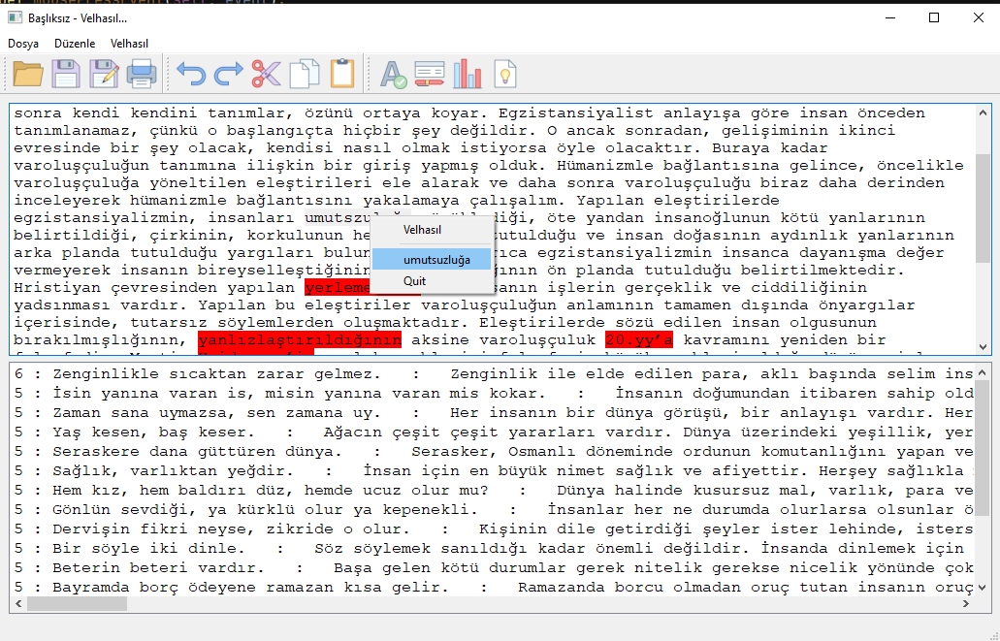

# Velhasıl...
> AçıkHack 2020 Doğal Dil İşleme Yarışması Projemiz.
## Velhası Projemizin Amacı
> Projemizin amacı; yazılı metinlerin Türkçe dil bilgisi kuralarına uygun olmasını sağlama ve metinlerin akıcılığını ve okunabilirliğini artırıcı öneriler sunmaktır. 

Uygulamamızın Çalışma Videosu : https://youtu.be/Oh7F1cy94lw

Proje Sunumumuz :  https://drive.google.com/file/d/1hpJ1zsIv0YDgEqhGRJDLZme18A1jAV0J/view?usp=sharing

## Projemizin Özellikleri

1. Yazım Denetimi: Yazım yanlışlarını, noktalama işareti hatalı kullanımlarını kontrol eder. 
2. Kelime Öneri : Yazım yanlışı yapılmış kelimeler için doğru olabilecek kelime önerir.
2. Türkçe Kelime Öneri : Türkçe kökenli olmayan kelimeler yerine Türkçe kelime önerir
3. Cümle Analizi : Metnin okunabilirliğinin ve akıcılığının artırılmasını sağlamak amacıyla metin içindeki cümleleri analiz eder ve uzun yazılmış birleşik cümlelerin bölünebilmesini önerir.
4. Metin İstatistikleri : Metnin kelime sayısı, cümle sayısı, karakter sayısı gibi istatistiklerini bulur.
5. Atasözü Öneri : Metnin tamamını inceler ve hazırladığımız 2500'e yakın atasözü içeren ver setimizi kullanark metinle alakalı atasözlerini bulur.



## Yükleme
> git clone https://github.com/MiniVelhasil/velhasil.git

> pip3 install -r requirements.txt

## Kullanım Örnekleri

### İstatistik Çıkarma

```sh
    velhasil_ = velhasil.Velhasil (text)

    # Gönderilen metinle ilgili istatistik bilgisi döndürür
    print ("*************Metin İstatistikleri************")
    print ("Kelime sayisi :", velhasil_.kelimesayisi)
    print ("benzersiz kelime sayisi :", velhasil_.benzersizkelimesayisi)
    print ("Karakter sayisi :", velhasil_.karaktersayisi)
    print ("Benzersiz karakter sayisi :", velhasil_.benzersizkaraktersayisi)
    print ("Paragraf sayisi :", velhasil_.paragrafSayisi)
    print ("Cümle sayisi :", velhasil_.cumleSayisi)
    print ("Kelimeler :", velhasil_.benzersizkelimeler)
    print ("**************************")
```

### Cümle Analizi:

```sh
    # Cümlenin bölünüp bölünmeyeceğini önerisini "true" veya "false" olarak bildirir
    cumleConuc =[]
    for cumle in velhasil_.cumleler:
       cumleConuc.append(velhasil_.cumleBolucu(cumle))
    print(cumleConuc)

    #for count, i in enumerate(velhasil_.cumleler):
        #print (count,":",i)

```

### Yazım Denetimi
```sh
    # Metindeki ilk cümleyi yazım kontrolünden geçirip en doğru halini döndürür
    print(velhasil_.yazimKontrolu(velhasil_.cumleler[0]))
    # Metindeki ilk cümleyi yazım kontrolünden geçirip en doğru halini döndürür
    print ("kelime önerileri " ,velhasil_.yazimDenetimi (text))
    print (velhasil_.turkcesiniOner ("etap"))
    # Metindeki ilk cümlenin ilk kelimesin ile ilgili yazım önerileri sunar
    print ("kelime önerileri " ,velhasil_.kelimeOneri ("yalnış"))

```
### Atasözü öneri sistemi
```sh
    atasozleri_ = atasozlerOneri.AtasozleriOneri ()
    oneriler = atasozleri_.atasozuBul (text)
    oneriler.sort(reverse=True)
```

## Masaüstü Arayüzü

Velhasıl metin analizi sınıfımızı test etmek için PyQt ile bir arayüz hazırladık. Bu masaüstü arayüzü kullanarak metin analizi, yazım denetimi gibi projemizin tüm özelliklerini kullanabilirsiniz. Çalıştırmak için alttaki komutu çalıştırın.

```sh
python notepad.py
```


## Gereksinimler

```sh
NlpToolkit-MorphologicalAnalysis==1.0.21
NlpToolkit-NGram=1.0.10
PyQt5-stubs==5.14.2.2
```

## Kullanılan Ek Kaynaklar

Atasözleri https://www.atasozlerianlamlari.com

Yazım Denetimi için https://github.com/StarlangSoftware/TurkishSpellChecker-Py 

Not Defteri Örneği : https://www.learnpyqt.com/examples/no2pads-simple-notepad-clone/

Masaüstü Uygulama ikonları https://icons8.com sitesinden alındı

